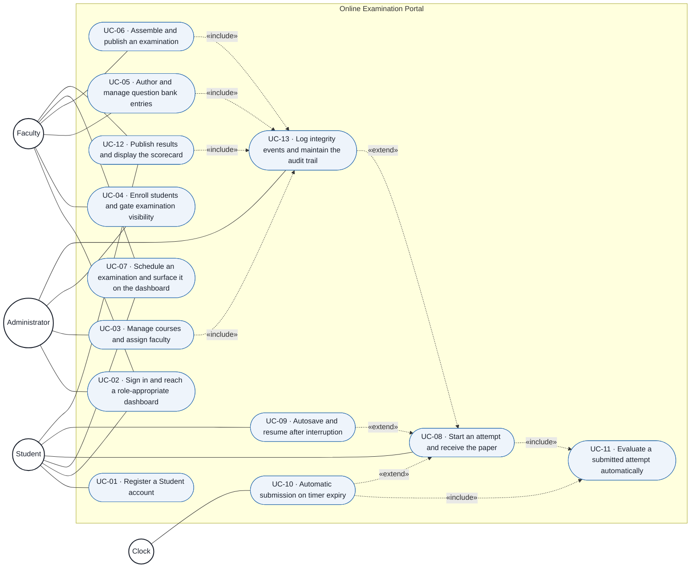
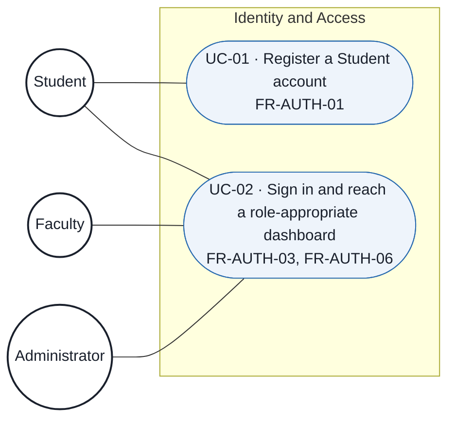
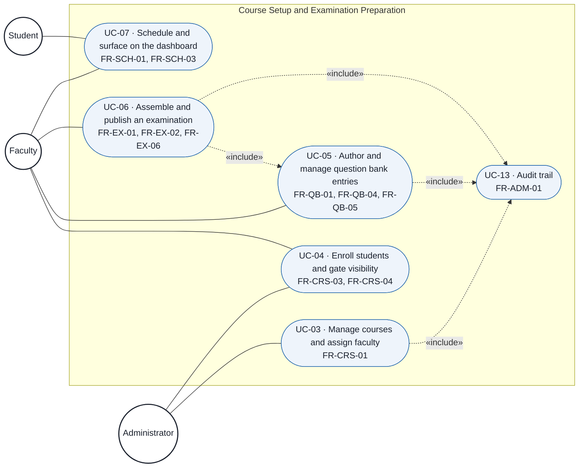
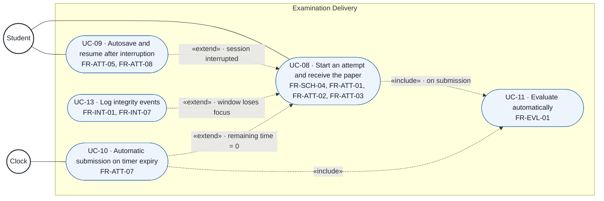
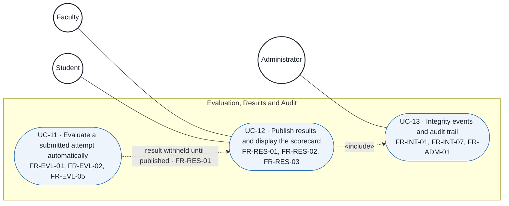

# Use Case Diagram — Online Examination Portal

**Course:** UE23CS341A — Software Engineering, PES University, Dept. of CSE
**Project:** Online Examination System with Multiple-Choice Questions and Evaluation
**Version:** 1.0 · **Date:** 2026-09-06
**Owner:** Komal (QA, Docs & Delivery)

This document specifies the use case model for the reduced baseline of 30 functional requirements
in `Documents/SRS Document.md`. The thirteen use cases below are the same thirteen used by
`Documents/Test Plan Document.md`, with identical identifiers, so the SRS, the use case model, the
test plan and the RTM share one identifier space.

The step-by-step flow of each use case is specified in `Documents/Use Case Flow.md`.

---

## 1. Notation

Diagrams are written in **Mermaid** inside Markdown. They render directly on GitHub, they produce a
readable `git diff` on every change, and they export to PNG for the end-of-semester deck. A binary
diagram file would leave no evidence trail, and this course grades the documented process.

| Symbol | Meaning |
|---|---|
| Circle | **Actor** — a role outside the system boundary that interacts with it |
| Rounded box | **Use case** — a complete, observable service the system provides to an actor |
| Enclosing box | **System boundary** — everything inside is built by this team |
| Solid line | **Association** — this actor participates in this use case |
| Dotted arrow, `«include»` | The base use case **always** performs the included one; the arrow points at the included use case |
| Dotted arrow, `«extend»` | The extending use case runs **only under a stated condition**, at a named extension point in the base use case; the arrow points at the base use case |

## 2. Actors

| Actor | Kind | Description | Requirements |
|---|---|---|---|
| **Student** | Primary, human | An enrolled candidate. Registers, signs in, sits examinations and views published results. | `FR-AUTH-01`, `FR-CRS-04`, `FR-SCH-03`, `FR-SCH-04`, `FR-ATT-*`, `FR-RES-03` |
| **Faculty** | Primary, human | Authors questions and examinations, schedules them, enrolls students, publishes results. | `FR-CRS-03`, `FR-QB-*`, `FR-EX-*`, `FR-SCH-01`, `FR-RES-02` |
| **Administrator** | Primary, human | Maintains courses, assigns Faculty to courses, reviews the audit trail. | `FR-CRS-01`, `FR-CRS-03`, `FR-ADM-01` |
| **Clock** | Secondary, non-human | The server clock. It is the only actor that triggers behaviour with no human present: it drives automatic submission when an attempt's remaining time reaches zero. | `FR-ATT-02`, `FR-ATT-07` |

### 2.1 Why "System" is not drawn as an actor

`Documents/SRS Document.md` lists **System** in the *Actor* column of `FR-EVL-01`, `FR-EVL-02`,
`FR-EVL-05`, `FR-RES-01`, `FR-INT-01`, `FR-INT-07` and `FR-ADM-01`. That column records *who is
responsible for the behaviour*, which is a useful thing for a requirements table to say.

An actor in UML is by definition **outside** the system boundary. The system cannot be an actor of
itself, so those requirements are not modelled as a `System` stick figure. They appear instead as:

- **automatic evaluation** (`FR-EVL-*`) — UC-11, reached by `«include»` from the submission that
  triggers it, so it can never be forgotten and needs no human trigger;
- **withholding results** (`FR-RES-01`) — a business rule constraining UC-12, not a use case;
- **integrity logging and audit** (`FR-INT-01`, `FR-INT-07`, `FR-ADM-01`) — UC-13, reached by
  `«extend»` from the attempt and by `«include»` from every mutating use case;
- **the countdown and its expiry** (`FR-ATT-02`, `FR-ATT-07`) — driven by the **Clock**, which
  genuinely is external to the application.

---

## 3. Master use case diagram

**Reading the master diagram.** The three human actors sit outside the boundary on the left; the
Clock sits outside it too, because the passage of time is not something the application controls.
Every use case that changes stored data points at UC-13, because `FR-ADM-01` requires an audit entry
for every mutation — drawing it makes the obligation impossible to overlook when the modules are
built. The attempt, UC-08, is the centre of the model: three use cases extend it, and it always
includes evaluation.

`UC-02 Sign in` is an implied `«include»` of every use case except UC-01, because `FR-AUTH-06`
restricts every screen and endpoint to an authorised role. Eleven identical arrows would obscure the
diagram rather than inform it, so the rule is stated once here and enforced as a pre-condition on
each use case in `Documents/Use Case Flow.md`.

---

## 4. Subsystem diagrams

The master diagram states the whole model; these four state it a subsystem at a time, at the level
of detail a developer needs when building one module.

### 4.1 Identity and access

Only a Student self-registers. Faculty and Administrator accounts are provisioned, never
self-served — `FR-AUTH-01` names the Student alone, and `FR-AUTH-06` assigns exactly one role to
every account.

### 4.2 Course, question bank, authoring and scheduling

UC-06 includes UC-05 because `FR-EX-02` assembles a paper **by selecting from the question bank** —
there is no path that authors a question inside the examination, which is what keeps the bank
reusable across papers.

### 4.3 Examination delivery

Three extensions, each with its own named condition, and one unconditional inclusion. The
distinction matters when the module is built: an `«extend»` is a branch that may never be taken in a
clean attempt, whereas the `«include»` on UC-11 must fire on **every** submission, manual or
automatic — `FR-EVL-01` allows no attempt to sit unevaluated.

### 4.4 Evaluation, results, integrity and audit

No actor is associated with UC-11. That is deliberate and is the whole point of `FR-EVL-01`:
evaluation has no human trigger and no human approval step. It is reachable only through the
`«include»` from a submission.

---

## 5. Use case to requirement traceability

| Use case | Primary actor | Requirements verified | Test cases |
|---|---|---|---|
| UC-01 Register a Student account | Student | `FR-AUTH-01` | `UT_001`–`UT_006`, `IT_001`–`IT_002`, `ST_001` |
| UC-02 Sign in and reach a role-appropriate dashboard | Student, Faculty, Administrator | `FR-AUTH-03`, `FR-AUTH-06` | `UT_007`–`UT_011`, `IT_003`–`IT_006`, `ST_002` |
| UC-03 Manage courses and assign faculty | Administrator | `FR-CRS-01` | `UT_012`–`UT_016`, `IT_007`–`IT_008`, `ST_003` |
| UC-04 Enroll students and gate examination visibility | Faculty, Administrator | `FR-CRS-03`, `FR-CRS-04` | `UT_017`–`UT_021`, `IT_009`–`IT_011`, `ST_004` |
| UC-05 Author and manage question bank entries | Faculty | `FR-QB-01`, `FR-QB-04`, `FR-QB-05` | `UT_022`–`UT_027`, `IT_012`–`IT_014`, `ST_005` |
| UC-06 Assemble and publish an examination | Faculty | `FR-EX-01`, `FR-EX-02`, `FR-EX-06` | `UT_028`–`UT_033`, `IT_015`–`IT_016`, `ST_006` |
| UC-07 Schedule an examination and surface it | Faculty, Student | `FR-SCH-01`, `FR-SCH-03` | `UT_034`–`UT_038`, `IT_017`–`IT_018`, `ST_007` |
| UC-08 Start an attempt and receive the paper | Student | `FR-SCH-04`, `FR-ATT-01`, `FR-ATT-02`, `FR-ATT-03` | `UT_039`–`UT_044`, `IT_019`–`IT_021`, `ST_008` |
| UC-09 Autosave and resume after interruption | Student | `FR-ATT-05`, `FR-ATT-08` | `UT_045`–`UT_048`, `IT_022`–`IT_025`, `ST_009` |
| UC-10 Automatic submission on timer expiry | Clock | `FR-ATT-07` | `UT_049`–`UT_052`, `IT_026`–`IT_028`, `ST_010` |
| UC-11 Evaluate a submitted attempt automatically | — (included, no actor) | `FR-EVL-01`, `FR-EVL-02`, `FR-EVL-05` | `UT_053`–`UT_058`, `IT_029`–`IT_031`, `ST_011` |
| UC-12 Publish results and display the scorecard | Faculty, Student | `FR-RES-01`, `FR-RES-02`, `FR-RES-03` | `UT_059`–`UT_063`, `IT_032`–`IT_034`, `ST_012` |
| UC-13 Log integrity events and maintain the audit trail | Administrator | `FR-INT-01`, `FR-INT-07`, `FR-ADM-01` | `UT_064`–`UT_068`, `IT_035`–`IT_037`, `ST_013` |

**Coverage: 30 of 30 functional requirements.** Every requirement in `Documents/SRS Document.md`
appears in exactly one use case's *Requirements verified* column, so the model is both complete and
free of duplicate ownership.

## 6. Relationship justification

An `«include»` or `«extend»` is only worth drawing if it is true of the built system. Each one below
is justified by a requirement, not by diagram convenience.

| From | Type | To | Condition / justification |
|---|---|---|---|
| UC-06 | `«include»` | UC-05 | `FR-EX-02` — a paper is assembled **by selecting** bank questions; there is no in-examination authoring path |
| UC-08 | `«include»` | UC-11 | `FR-EVL-01` — every submitted attempt is evaluated automatically, with no human intervention |
| UC-10 | `«include»` | UC-11 | An auto-submitted attempt is evaluated on exactly the same path as a manual one — verified by `IT_028` |
| UC-09 | `«extend»` | UC-08 | Extension point *session interrupted*. `FR-ATT-08` — resume applies only after an interruption; a clean attempt never takes this branch |
| UC-10 | `«extend»` | UC-08 | Extension point *remaining time reaches zero*. `FR-ATT-07` — does not occur if the Student submits first |
| UC-13 | `«extend»` | UC-08 | Extension point *examination window loses focus*. `FR-INT-01` — no event is recorded if focus is never lost (`UT_066`) |
| UC-03, UC-05, UC-06, UC-12 | `«include»` | UC-13 | `FR-ADM-01` — every creation, modification and deletion of a user, question, examination, answer key or result writes an append-only audit entry |
| every use case except UC-01 | `«include»` | UC-02 | `FR-AUTH-06` — every screen and endpoint is restricted to authorised roles. Stated as a rule, not drawn, to keep the diagram readable |

## 7. Boundary notes

- **`FR-RES-01` is a constraint, not a use case.** Withholding an evaluated result until Faculty
  publishes it is a rule that governs when UC-12 discloses data. It carries no actor-visible steps
  of its own, so modelling it as a use case would invent a service that nobody invokes.
- **The Administrator is not a super-user.** `FR-AUTH-06` gives every account exactly one role. The
  Administrator maintains courses, enrolls students and reads the audit trail; the Administrator
  does **not** author questions, publish results or sit examinations. The absence of those
  associations is the model asserting that, not an omission.
- **There is no Proctor actor.** Integrity monitoring is automated and evidentiary: the system logs
  and flags, a human decides. This was settled at the M1 baseline and is unchanged.
- **Out of scope, therefore absent:** descriptive answers and manual grading, webcam or AI
  proctoring, biometric identity verification, payments, adaptive testing, native mobile
  applications, offline mode, plagiarism detection.

## 8. Related documents

| Document | Relationship |
|---|---|
| `Documents/SRS Document.md` | The 30 functional and 10 non-functional requirements this model realises |
| `Documents/Use Case Flow.md` | The step-by-step main, alternate and exception flows of all thirteen use cases |
| `Documents/Test Plan Document.md` | 118 test cases, grouped by the same thirteen use case identifiers |
| `PRD_01_Online_Exam_Portal.md` | Product vision and the full requirement space |
| `docs/CHANGELOG.md` | CR-01, the scope reduction that produced this baseline |
