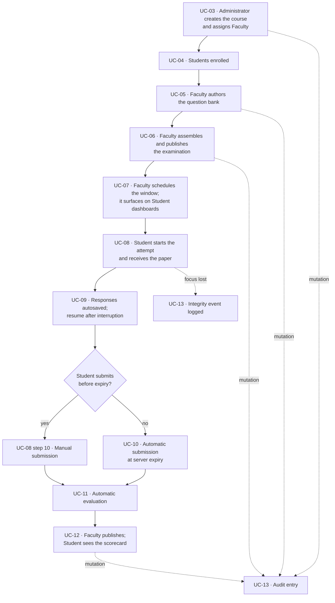

# Use Case Flow — Online Examination Portal

**Course:** UE23CS341A — Software Engineering, PES University, Dept. of CSE
**Project:** Online Examination System with Multiple-Choice Questions and Evaluation
**Version:** 1.0 · **Date:** 2026-09-06
**Owner:** Kartik (Frontend & UX)

The step-by-step flow of each of the thirteen use cases in `Documents/Use Case Diagram.md`. Every
use case is specified with its main success scenario, its alternate flows, its exception flows and
the business rules that constrain it.

Identifiers are the shared space used by `Documents/SRS Document.md`, `Documents/Use Case
Diagram.md` and `Documents/Test Plan Document.md`. Each flow step that is directly verified names
the test case that verifies it, so this document doubles as the narrative half of the RTM.

---

## 1. How to read a flow

| Section | What it holds |
|---|---|
| **Main success scenario** | The path when nothing goes wrong. Numbered, alternating actor step and system step. |
| **Alternate flows** (`A`) | A different but still *successful* path, or a recoverable rejection. Numbered against the main step it branches from — `A1 (step 5)` branches at step 5. |
| **Exception flows** (`E`) | The use case cannot complete. The system leaves no partial state behind. |
| **Business rules** (`BR`) | Constraints that hold across every path, not steps in any one of them. |

Two conventions hold throughout and are not repeated in each use case:

- **Authorisation.** Except for UC-01, every use case has the implicit pre-condition that the actor
  is signed in through UC-02 and holds the role named as its primary actor. `FR-AUTH-06` restricts
  every screen *and* every API endpoint, so a direct API call by the wrong role is refused with
  HTTP 403 and a direct call by an unauthenticated client with HTTP 401 — verified by `IT_004`,
  `IT_005` and `IT_006`.
- **Audit.** Every use case that creates, modifies or deletes a user, question, examination, answer
  key or result writes an append-only audit entry as part of the same transaction. `FR-ADM-01`, and
  UC-13 below.

---

## UC-01 — Register a Student account

| | |
|---|---|
| **Use case ID** | UC-01 |
| **Primary actor** | Student (as an unauthenticated visitor) |
| **Secondary actors** | — |
| **Requirements** | `FR-AUTH-01` |
| **Stakeholders** | *Student* — wants an account without waiting on an administrator. *Institution* — wants only its own members admitted, and personal data handled lawfully (`NFR-E-01`). |
| **Trigger** | The visitor selects **Register** on the portal landing page. |
| **Pre-conditions** | The portal is reachable. No account exists for the visitor's institutional email address or roll number. |
| **Post-conditions (success)** | A Student account exists and can sign in immediately. The password is stored as a salted hash. Consent is recorded. An audit entry is written. |
| **Post-conditions (failure)** | No account, and no partial row, exists. Nothing about an existing account is disclosed or changed. |
| **Frequency** | High at the start of a semester, then rare. |

**Main success scenario**

1. The visitor opens the registration page.
2. The system presents a form asking for full name, institutional email address, roll number and
   password, together with the data-processing consent statement required by `NFR-E-01`.
3. The visitor enters the four values and gives consent.
4. The visitor submits the form.
5. The system validates that all four fields are present, that the email is well formed and on the
   configured institutional domain, that neither the email nor the roll number is already
   registered, and that the password meets the configured policy.
6. The system creates the account with role **Student** and stores the password as a salted hash.
7. The system records the consent and writes an audit entry.
8. The system confirms *"Registration successful"* and offers the sign-in page.

**Alternate flows**

- **A1 (step 5) — a mandatory field is empty.** The system rejects the submission, marks the
  offending field with an inline error, creates no account, and returns the visitor to step 3 with
  the other entries preserved. `UT_002`
- **A2 (step 5) — the email is not on the institutional domain.** Rejected with *"Please register
  with your institutional email address."* Return to step 3. `UT_003`
- **A3 (step 5) — the email is malformed.** Rejected with *"Enter a valid email address."* Return
  to step 3. `UT_004`
- **A4 (step 5) — the email is already registered.** Rejected with *"An account with this email
  already exists."* The existing account is not modified in any way. `UT_005`
- **A5 (step 5) — the roll number is already registered.** Rejected with *"This roll number is
  already registered."* Return to step 3. `UT_006`

**Exception flows**

- **E1 (step 6) — two registrations for the same roll number arrive simultaneously.** Exactly one
  account is created; the other is rejected as a duplicate. No orphaned or partial row survives.
  `IT_002`
- **E2 (step 6) — the datastore is unavailable.** The transaction is rolled back, no account is
  created, and the visitor is told to retry. No confirmation is shown.

**Business rules**

- **BR-01.** The accepted institutional domain is configuration, not code (`NFR-E-06`).
- **BR-02.** The plaintext password appears nowhere — not in the database, not in application logs.
  `IT_001`
- **BR-03.** Self-registration yields the **Student** role and only that role. Faculty and
  Administrator accounts are provisioned, never self-served (`FR-AUTH-06`).
- **BR-04.** A Student's personal data is erasable on request within 30 days (`NFR-E-01`).

**Test cases:** `UT_001`–`UT_006`, `IT_001`–`IT_002`, `ST_001`

---

## UC-02 — Sign in and reach a role-appropriate dashboard

| | |
|---|---|
| **Use case ID** | UC-02 |
| **Primary actor** | Student, Faculty or Administrator |
| **Requirements** | `FR-AUTH-03`, `FR-AUTH-06` |
| **Stakeholders** | *User* — wants to reach their own work in one step. *Institution* — wants no account enumerable and no role able to reach another's data. |
| **Trigger** | The user opens the sign-in page, or requests a protected page while holding no session. |
| **Pre-conditions** | The account exists and is active. |
| **Post-conditions (success)** | A session is established, bound to exactly one role, with a session identifier regenerated at sign-in. The user is on the dashboard for that role. |
| **Post-conditions (failure)** | No session is established. The failure message does not reveal whether the email exists. |
| **Frequency** | Very high — every interaction with the portal begins here. |

**Main success scenario**

1. The user opens the sign-in page.
2. The system presents fields for email address and password.
3. The user enters both and submits.
4. The system verifies the email against the stored account and the password against the stored
   salted hash.
5. The system regenerates the session identifier and establishes a session bound to the account's
   single role.
6. The system routes the user to the dashboard for that role — Student, Faculty or Administrator.
7. Every subsequent screen request and API call is authorised against that role for the life of the
   session.

**Alternate flows**

- **A1 (step 4) — the email is correct but the password is wrong.** Sign-in is refused with
  *"Invalid email or password."* No session is established. `UT_008`
- **A2 (step 4) — the email is not registered.** Refused with the **identical** message and a
  comparable response time, so accounts cannot be enumerated by probing. `UT_009`
- **A3 (step 3) — the password field is empty.** Refused client-side with *"Password is required."*
  No authentication attempt is recorded. `UT_010`

**Exception flows**

- **E1 (step 7) — a Student calls a Faculty-only endpoint directly, bypassing the UI.** HTTP 403;
  nothing is created and no Faculty data is returned in the body. `IT_004`
- **E2 (step 7) — a Faculty member calls an Administrator-only endpoint.** HTTP 403. `IT_005`
- **E3 (step 7) — an unauthenticated client calls any protected endpoint.** HTTP 401. No endpoint
  defaults to open. `IT_006`

**Business rules**

- **BR-01.** Exactly one role per account — never none, never two (`FR-AUTH-06`). `UT_011`
- **BR-02.** The session identifier held before authentication is invalidated at sign-in, so a
  fixated session cannot be reused. `IT_003`
- **BR-03.** Authorisation is enforced at the API, not merely by hiding UI controls. Hiding a button
  is a usability choice; refusing the endpoint is the control. `ST_002`

**Test cases:** `UT_007`–`UT_011`, `IT_003`–`IT_006`, `ST_002`

---

## UC-03 — Manage courses and assign faculty

| | |
|---|---|
| **Use case ID** | UC-03 |
| **Primary actor** | Administrator |
| **Requirements** | `FR-CRS-01` |
| **Includes** | UC-13 (audit entry) |
| **Stakeholders** | *Administrator* — wants the semester's course list to reflect the department's offering. *Faculty* — wants their assigned courses to appear on their dashboard. |
| **Trigger** | The Administrator opens **Course Administration**. |
| **Pre-conditions** | The Administrator is signed in. The Faculty accounts to be assigned already exist. |
| **Post-conditions (success)** | The course exists with its code, title and semester, and carries one or more assigned Faculty. Each assigned Faculty sees it. An audit entry is written. |
| **Post-conditions (failure)** | The course list is unchanged. |
| **Frequency** | Once per course per semester, plus occasional edits. |

**Main success scenario**

1. The Administrator opens Course Administration.
2. The system lists the existing courses with their code, title, semester and assigned Faculty.
3. The Administrator selects **Create Course**.
4. The Administrator enters the course code, the title and the semester.
5. The Administrator assigns one or more Faculty accounts to the course.
6. The system validates the entry and persists the course together with its Faculty assignments.
7. The system writes an audit entry recording the actor, the action, the entity and the values.
8. The course appears in the list as active, and on the dashboard of every assigned Faculty member.

**Alternate flows**

- **A1 (step 3) — edit an existing course.** The Administrator opens a course, changes its title,
  semester or Faculty assignment, and saves. The system revalidates and writes an audit entry
  carrying both the previous and the new values.
- **A2 (step 3) — archive a course.** The course stops accepting new examinations and disappears
  from the active list. Existing examinations, attempts and results are preserved unchanged — an
  archive is not a delete, because results must survive for the audit trail.
- **A3 (step 5) — assign a further Faculty member later.** A course may carry more than one Faculty
  account; assignment is additive and reversible.

**Exception flows**

- **E1 (step 6) — the course code duplicates an existing course.** Rejected; the existing course is
  untouched.
- **E2 (step 6) — a mandatory field is missing.** Rejected with an inline error; nothing is
  persisted.
- **E3 (any step) — a Faculty member or Student reaches the course-administration endpoint
  directly.** HTTP 403 (`FR-AUTH-06`). `IT_005`

**Business rules**

- **BR-01.** A course is identified by its course code, which is unique.
- **BR-02.** A course with no assigned Faculty is permitted at creation but cannot have an
  examination authored against it, because authoring requires an assigned Faculty member.
- **BR-03.** Course creation, edit and archive are Administrator-only. Faculty maintain content
  within a course, not the course itself.

**Test cases:** `UT_012`–`UT_016`, `IT_007`–`IT_008`, `ST_003`

---

## UC-04 — Enroll students and gate examination visibility

| | |
|---|---|
| **Use case ID** | UC-04 |
| **Primary actor** | Faculty or Administrator |
| **Requirements** | `FR-CRS-03`, `FR-CRS-04` |
| **Stakeholders** | *Faculty* — wants their cohort in place before an examination opens. *Student* — wants to see their own courses and nobody else's. |
| **Trigger** | Faculty or the Administrator opens the enrollment view of a course. |
| **Pre-conditions** | The course exists and is active. The Student accounts exist. The actor is an Administrator, or Faculty assigned to that course. |
| **Post-conditions (success)** | The Student is enrolled in the course and can see and attempt its published, scheduled examinations. |
| **Post-conditions (failure)** | The enrollment list is unchanged, and visibility is unchanged. |
| **Frequency** | Concentrated at the start of a semester. |

**Main success scenario**

1. The actor opens a course and selects **Enrollment**.
2. The system lists the Students currently enrolled.
3. The actor selects **Enroll Student** and identifies the Student by roll number or email address.
4. The system verifies that the account exists, holds the Student role, and is not already enrolled.
5. The system records the enrollment.
6. The Student's dashboard now lists that course, and the course's published, scheduled
   examinations become visible to that Student and to no one outside the enrollment.

**Alternate flows**

- **A1 (step 3) — enroll several Students in one pass.** The actor identifies each in turn; the
  system validates each independently, so one invalid entry does not discard the valid ones.
- **A2 (step 3) — remove an enrollment.** The Student loses visibility of that course's future
  examinations. Attempts and results already recorded are preserved, because removing a person from
  a list must not erase evidence of what they sat.

**Exception flows**

- **E1 (step 4) — the account does not exist.** Rejected; the actor is told no such Student was
  found.
- **E2 (step 4) — the account is Faculty or Administrator.** Rejected; only a Student role can be
  enrolled as a candidate.
- **E3 (step 4) — the Student is already enrolled.** Rejected as a duplicate; exactly one
  enrollment row is held per Student per course.
- **E4 (step 6) — a Student calls the examination endpoint for a course they are not enrolled in.**
  HTTP 403, and no examination metadata is returned. `FR-CRS-04` is an access control, not a UI
  filter. `IT_011`

**Business rules**

- **BR-01.** A Student may view and attempt only examinations belonging to a course in which the
  Student is enrolled (`FR-CRS-04`).
- **BR-02.** Faculty may enroll Students only into a course they are assigned to; an Administrator
  may enroll into any course.
- **BR-03.** Enrollment gates *visibility*; it does not by itself permit an attempt. UC-08 applies
  the window, the enrollment and the no-prior-submission checks together (`FR-SCH-04`).

**Test cases:** `UT_017`–`UT_021`, `IT_009`–`IT_011`, `ST_004`

---

## UC-05 — Author and manage question bank entries

| | |
|---|---|
| **Use case ID** | UC-05 |
| **Primary actor** | Faculty |
| **Requirements** | `FR-QB-01`, `FR-QB-04`, `FR-QB-05` |
| **Includes** | UC-13 (audit entry) |
| **Stakeholders** | *Faculty* — wants a tagged, reusable pool rather than rewriting questions per paper. *Student* — depends on the answer key being right and on a live paper never changing beneath them. |
| **Trigger** | Faculty opens the question bank for a course and selects **New Question**. |
| **Pre-conditions** | Faculty is signed in and assigned to the course. |
| **Post-conditions (success)** | The question exists with a stem, 2 to 6 options, exactly one correct option, and its course, topic, difficulty, positive marks and negative marks. An audit entry is written. |
| **Post-conditions (failure)** | The bank is unchanged. |
| **Frequency** | High during preparation, then steady reuse. |

**Main success scenario**

1. Faculty opens the question bank for a course.
2. The system lists the existing questions with their topic, difficulty and marks.
3. Faculty selects **New Question**.
4. Faculty enters the question stem.
5. Faculty enters between two and six options and marks exactly one of them correct.
6. Faculty sets the course, the topic label, the difficulty — Easy, Medium or Hard — the positive
   marks and the negative marks.
7. The system validates the option count, the single correct option and the presence of every
   mandatory attribute.
8. The system persists the question as version 1 and writes an audit entry.
9. The question becomes available for selection during examination assembly (UC-06).

**Alternate flows**

- **A1 (step 3) — edit a question not yet used.** The question belongs to no published or attempted
  examination, so it is edited in place. The audit entry records the previous and the new values.
  `UT_068`
- **A2 (step 3) — edit a question that *is* in a published or attempted examination.** The system
  refuses to modify it in place and instead creates a **new version**. The examination that already
  used the earlier version continues to reference that version, so a paper cannot change beneath a
  candidate mid-window. `FR-QB-05`
- **A3 (step 3) — delete a question.** Permitted only while the question belongs to no published or
  attempted examination. Otherwise it is retired from selection, never removed.

**Exception flows**

- **E1 (step 7) — fewer than two or more than six options.** Rejected with the permitted range
  stated.
- **E2 (step 7) — no option, or more than one option, marked correct.** Rejected; a single-correct
  MCQ must carry exactly one key (`FR-QB-01`).
- **E3 (step 7) — a mandatory attribute is missing.** Course, topic, difficulty, positive marks and
  negative marks are all mandatory (`FR-QB-04`).
- **E4 (step 8) — a delete is attempted on a question inside an attempted examination.** Refused at
  the database, not only in the UI, so a direct write cannot bypass it. `IT_014`

**Business rules**

- **BR-01.** A question in a published or attempted examination is immutable; a change produces a
  new version (`FR-QB-05`). This is what makes a result defensible after the fact.
- **BR-02.** Difficulty is one of exactly three values — Easy, Medium, Hard.
- **BR-03.** Positive and negative marks live on the *question*; whether negative marking is applied
  at all lives on the *examination* (`FR-EX-01`). Both must agree before a score is meaningful.
- **BR-04.** A question belongs to exactly one course, which is what scopes the bank.

**Test cases:** `UT_022`–`UT_027`, `IT_012`–`IT_014`, `ST_005`

---

## UC-06 — Assemble and publish an examination

| | |
|---|---|
| **Use case ID** | UC-06 |
| **Primary actor** | Faculty |
| **Requirements** | `FR-EX-01`, `FR-EX-02`, `FR-EX-06` |
| **Includes** | UC-05 (question selection), UC-13 (audit entry) |
| **Stakeholders** | *Faculty* — wants a paper assembled from existing questions with the policy set once. *Student* — must never see a Draft. |
| **Trigger** | Faculty selects **New Examination** within a course. |
| **Pre-conditions** | Faculty is signed in and assigned to the course. The course's question bank holds the questions to be used. |
| **Post-conditions (success)** | The examination exists in **Published** state with its questions, its duration, its declared total marks, its instructions and its policy values. An audit entry is written. |
| **Post-conditions (failure)** | The examination remains in **Draft**, or is not created at all. It is invisible to Students either way. |
| **Frequency** | A few times per course per semester. |

**Main success scenario**

1. Faculty selects **New Examination** within a course.
2. The system presents the examination form.
3. Faculty enters the title, the duration in minutes, the declared total marks and the free-text
   instructions.
4. Faculty sets the policy values: whether negative marking is enabled and its value, whether
   questions and options are shuffled, and the pass mark.
5. The system creates the examination in **Draft** state.
6. Faculty opens the question selector and picks questions from the course's bank (UC-05).
7. The system adds each selected question to the paper, holding a reference to the exact version
   selected.
8. Faculty reviews the assembled paper.
9. Faculty selects **Publish**.
10. The system moves the examination to **Published** state and writes an audit entry.
11. The examination becomes eligible for scheduling (UC-07). It is not yet visible to any Student,
    because visibility also requires a schedule.

**Alternate flows**

- **A1 (step 6) — remove a question from the paper.** Permitted while the examination is in Draft.
  The question itself is untouched in the bank.
- **A2 (step 8) — save and return later.** The examination stays in Draft indefinitely and remains
  invisible to Students throughout (`FR-EX-06`).
- **A3 (step 4) — negative marking disabled.** An incorrect response then scores exactly zero rather
  than a negative value. `UT_056`

**Exception flows**

- **E1 (step 9) — publish is attempted with no questions attached.** Refused; an empty paper cannot
  be published.
- **E2 (step 6) — a question from a different course is selected.** Refused; the selector is scoped
  to the examination's own course.
- **E3 (step 9) — a Student or a Faculty member not assigned to the course calls the publish
  endpoint.** HTTP 403 (`FR-AUTH-06`).
- **E4 (any step) — a Student requests a Draft examination by identifier.** HTTP 403 and no
  metadata is returned; Draft is a state, not a hidden link. `IT_016`

**Business rules**

- **BR-01.** Only **Published** examinations are visible to Students; a Draft is invisible whatever
  its schedule (`FR-EX-06`).
- **BR-02.** The paper references a specific *version* of each question, which is what makes
  `FR-QB-05` effective.
- **BR-03.** Policy values — negative marking, shuffling and the pass mark — are per examination,
  set at authoring and configurable at run time, never hard-coded (`NFR-E-06`).
- **BR-04.** The declared total marks are recorded as entered. Whether they must equal the sum of
  the question marks was `FR-EX-04`, dropped by CR-01; the mismatch is a known accepted risk,
  recorded in `docs/CHANGELOG.md`.

**Test cases:** `UT_028`–`UT_033`, `IT_015`–`IT_016`, `ST_006`

---

## UC-07 — Schedule an examination and surface it on the Student dashboard

| | |
|---|---|
| **Use case ID** | UC-07 |
| **Primary actor** | Faculty (scheduling); Student (viewing) |
| **Requirements** | `FR-SCH-01`, `FR-SCH-03` |
| **Stakeholders** | *Faculty* — wants a fixed window the whole cohort sits within. *Student* — wants to know what is coming, what is live now, and what is finished. |
| **Trigger** | Faculty opens a published examination and selects **Schedule**; or a Student opens their dashboard. |
| **Pre-conditions** | The examination is **Published** (UC-06). Students are enrolled in the course (UC-04). |
| **Post-conditions (success)** | The examination carries a window start and a window end, and appears on every enrolled Student's dashboard under Upcoming, Live or Completed according to the server clock. |
| **Post-conditions (failure)** | The examination has no window and appears on no Student dashboard. |
| **Frequency** | Once per examination, with occasional rescheduling before the window opens. |

**Main success scenario**

1. Faculty opens a published examination and selects **Schedule**.
2. Faculty sets the window start date-time and the window end date-time.
3. The system validates that the end is after the start, and persists the window.
4. The system writes an audit entry.
5. Each enrolled Student opens their dashboard.
6. The system lists that Student's examinations under three headings, derived from the **server**
   clock against each window: **Upcoming** before the start, **Live** between start and end,
   **Completed** after the end or after the Student has submitted.
7. A Live examination presents a **Start** control (UC-08).

**Alternate flows**

- **A1 (step 2) — reschedule before the window opens.** Faculty changes either boundary; the
  dashboards of all enrolled Students reflect the change on their next load, and an audit entry
  records both the previous and the new values.
- **A2 (step 6) — the Student has already submitted while the window is still open.** The
  examination moves to **Completed** for that Student alone; the cohort still sees it as Live.
- **A3 (step 6) — the Student is enrolled in no course.** The dashboard renders with an empty state,
  not an error.

**Exception flows**

- **E1 (step 3) — the window end is at or before the window start.** Rejected; no window is
  persisted.
- **E2 (step 1) — scheduling is attempted on a Draft examination.** Refused; a schedule presupposes
  publication (`FR-EX-06`).
- **E3 (step 6) — a Student requests the dashboard feed for a course they are not enrolled in.**
  HTTP 403 (`FR-CRS-04`).

**Business rules**

- **BR-01.** Upcoming, Live and Completed are computed from the server clock. A client clock has no
  effect on any of the three (`FR-ATT-02`).
- **BR-02.** A Student's dashboard shows only the courses that Student is enrolled in
  (`FR-CRS-04`, `FR-SCH-03`).
- **BR-03.** Validating the window against the examination duration was `FR-SCH-02`, dropped by
  CR-01. A window shorter than the duration is therefore possible and is Faculty's responsibility —
  recorded as an accepted risk in `docs/CHANGELOG.md`.

**Test cases:** `UT_034`–`UT_038`, `IT_017`–`IT_018`, `ST_007`

---

## UC-08 — Start an attempt and receive the paper

| | |
|---|---|
| **Use case ID** | UC-08 |
| **Primary actor** | Student |
| **Secondary actors** | Clock |
| **Requirements** | `FR-SCH-04`, `FR-ATT-01`, `FR-ATT-02`, `FR-ATT-03` |
| **Includes** | UC-11 (on submission) |
| **Extended by** | UC-09 *(session interrupted)*, UC-10 *(remaining time reaches zero)*, UC-13 *(window loses focus)* |
| **Stakeholders** | *Student* — wants the full duration, reliable navigation and no lost work. *Faculty* — wants every candidate to get the same duration and no candidate to see the key. |
| **Trigger** | The Student selects **Start** on a Live examination. |
| **Pre-conditions** | The Student is signed in and enrolled. The examination is Published and its window is currently open by the server clock. The Student has no previously submitted attempt for it. |
| **Post-conditions (success)** | An attempt record exists, stamped with the server start time. The paper is delivered without any answer-key data. The countdown runs from server time. |
| **Post-conditions (failure)** | No attempt record is created, and no question payload is delivered. |
| **Frequency** | Once per Student per examination. |

**Main success scenario**

1. The Student opens a Live examination and selects **Start**.
2. The system checks, against the server clock, that the current time lies inside the window, that
   the Student is enrolled, and that no submitted attempt already exists for this Student and
   examination.
3. The system creates the attempt record, stamped with the **server** start time.
4. Only after that record exists does the system deliver the question payload. `IT_019`
5. The system strips every correct-answer field from the payload — no key, no `isCorrect`, nothing
   in the client-side state (`FR-INT-07`). `IT_035`
6. The system displays exactly one question at a time, together with the navigation palette.
7. The palette shows every question in one of four states: **Not Visited**, **Not Answered**,
   **Answered**, **Marked for Review**.
8. The system displays a countdown whose remaining time is derived from the server clock and the
   stored start time, never from the client clock.
9. The Student navigates and answers; each response is persisted automatically (UC-09).
10. The Student selects **Submit** and confirms.
11. The system records the submission with a server timestamp, moves the attempt to **Submitted**,
    and refuses every further response.
12. The system evaluates the attempt automatically (UC-11).

**Alternate flows**

- **A1 (step 9) — the Student marks a question for review.** The palette state becomes *Marked for
  Review*; the response, if any, is retained. `UT_043`
- **A2 (step 9) — the Student clears a response.** The stored response is emptied and the palette
  returns the question to *Not Answered*. `UT_047`
- **A3 (step 9) — the session is interrupted.** UC-09 applies at the extension point *session
  interrupted*.
- **A4 (step 10) — the Student never submits and the timer expires.** UC-10 applies at the extension
  point *remaining time reaches zero*.
- **A5 (step 9) — the examination window loses focus.** UC-13 applies at the extension point *window
  loses focus*. The attempt itself is not interrupted; the event is recorded.

**Exception flows**

- **E1 (step 2) — the window has not opened.** Refused with *"This examination has not opened yet."*
  No attempt record is created. `UT_039`
- **E2 (step 2) — the window has closed.** Refused with *"This examination has closed."* `UT_040`
- **E3 (step 2) — a submitted attempt already exists.** Refused with *"You have already submitted
  this examination."* No second attempt is created. `UT_041`
- **E4 (step 2) — the Student is not enrolled.** HTTP 403 (`FR-CRS-04`).
- **E5 (step 8) — the client clock is altered.** The remaining time is unaffected, because it is
  derived server-side. `UT_042`, `IT_020`

**Business rules**

- **BR-01.** The attempt record is created **before** the paper is delivered, so a paper can never
  be seen without a timed attempt existing to account for it (`FR-ATT-01`). `IT_019`
- **BR-02.** Every timing decision uses the server clock (`FR-ATT-02`), which is why `NFR-P-07`
  requires NTP synchronisation.
- **BR-03.** Exactly one question stem is present in the delivered markup; the remaining stems are
  not merely hidden with CSS. `UT_044`
- **BR-04.** Palette state is derived from server-held response data, so it survives a reload
  unchanged. `IT_021`
- **BR-05.** One attempt per Student per examination. Per-student shuffling of questions and options
  was `FR-ATT-10` and `FR-INT-06`, both dropped by CR-01.

**Test cases:** `UT_039`–`UT_044`, `IT_019`–`IT_021`, `ST_008`

---

## UC-09 — Autosave and resume after interruption

| | |
|---|---|
| **Use case ID** | UC-09 |
| **Primary actor** | Student |
| **Requirements** | `FR-ATT-05`, `FR-ATT-08` |
| **Extends** | UC-08, at extension point *session interrupted* |
| **Stakeholders** | *Student* — must not lose answers to a dropped connection or a crashed browser. *Faculty* — must not have a resumption hand back extra time. |
| **Trigger** | Autosave: the Student selects, changes or clears a response. Resume: the Student reopens an attempt that is still in progress. |
| **Pre-conditions** | An attempt is in progress and has not been submitted. |
| **Post-conditions (success)** | Every response is on the server within 5 seconds of selection. On resume, all persisted responses are restored and the remaining time is computed from the original start time. |
| **Post-conditions (failure)** | The Student is told the response is unsaved and the client retries; no response is silently dropped. |
| **Frequency** | Autosave: continuously. Resume: occasionally. |

**Main success scenario**

1. The Student selects an option on a question.
2. Without any explicit save action — there is no Save control — the client sends the response to
   the server.
3. The server commits it within 5 seconds of the selection and acknowledges. `IT_022`
4. The palette updates that question to *Answered*.
5. *(Resume)* The session is interrupted — the network drops, the browser is closed or the device
   changes.
6. The Student signs in again and reopens the examination.
7. The system recognises the in-progress attempt and restores every persisted response.
8. The system computes the remaining time from the **original** server start time and the
   configured duration, and resumes the countdown from there.
9. The Student continues from where they were.

**Alternate flows**

- **A1 (step 1) — the Student changes an existing response.** The new value replaces the old;
  exactly one response is held per question. `UT_046`
- **A2 (step 1) — the Student clears a response.** The cleared state is persisted and the palette
  returns to *Not Answered*. `UT_047`
- **A3 (step 6) — the Student resumes on a different device or browser profile.** The same attempt
  is restored, with the same responses and the same remaining time, because the state is server-held
  and not in browser storage. `IT_025`
- **A4 (step 6) — the duration has already elapsed during the interruption.** UC-10 has already
  auto-submitted the attempt; the Student is shown the submitted state, not a resumable one.
  `IT_026`

**Exception flows**

- **E1 (step 3) — the persistence request fails or times out.** The client retries. The response is
  not treated as saved until the server acknowledges, and the Student is shown an unsaved
  indication.
- **E2 (step 5) — the browser process is killed without warning.** Every response already
  acknowledged is intact on resume; nothing depended on an unload handler. `IT_023`

**Business rules**

- **BR-01.** No Save control exists. Persistence is automatic within 5 seconds (`FR-ATT-05`).
  `UT_045`
- **BR-02.** Resumption never grants extra time. Remaining time is always `start + duration − now`
  on the server clock (`FR-ATT-08`). `UT_048`, `IT_024`
- **BR-03.** Responses live on the server, never only in `localStorage`, which is what makes A3
  work and what makes `NFR-P-07` recoverable.
- **BR-04.** After an unplanned server restart, in-progress attempts remain resumable with responses
  intact and the correct remaining time (`NFR-P-07`).

**Test cases:** `UT_045`–`UT_048`, `IT_022`–`IT_025`, `ST_009`

---

## UC-10 — Automatic submission on timer expiry

| | |
|---|---|
| **Use case ID** | UC-10 |
| **Primary actor** | Clock |
| **Requirements** | `FR-ATT-07` |
| **Extends** | UC-08, at extension point *remaining time reaches zero* |
| **Includes** | UC-11 |
| **Stakeholders** | *Student* — wants everything answered so far to count. *Faculty* — wants the duration enforced identically for everyone, whatever the candidate's browser is doing. |
| **Trigger** | The remaining time of an in-progress attempt reaches zero on the server clock. |
| **Pre-conditions** | An attempt is in progress and has not been submitted. |
| **Post-conditions (success)** | The attempt is **Submitted**, with a server timestamp equal to the start plus the duration. Every response persisted up to that instant is retained. No further response is accepted. The attempt enters evaluation. |
| **Post-conditions (failure)** | None — expiry is enforced server-side and cannot be declined. |
| **Frequency** | Whenever a candidate does not submit in time. |

**Main success scenario**

1. The server clock reaches the attempt's start time plus its configured duration.
2. The system submits the attempt automatically, with no action by the Student.
3. The system retains every response persisted up to that instant; unanswered questions are recorded
   as unattempted.
4. The system sets the attempt state to **Submitted** and stamps a server-generated submission time.
5. The system makes the attempt screen read-only and displays *"Time is up. Your paper has been
   submitted."*
6. The system refuses every further response for that attempt.
7. The system evaluates the attempt automatically on the same path as a manual submission (UC-11).
   `IT_028`

**Alternate flows**

- **A1 (step 1) — the Student submits manually first.** This use case does not run; UC-08 step 10
  applies instead.
- **A2 (step 5) — the browser was closed before expiry.** The attempt is still submitted at the true
  expiry. The Student sees the submitted state when they next sign in. `IT_026`

**Exception flows**

- **E1 (step 6) — a response-save call arrives for the attempt after submission.** Refused with
  *"This attempt has already been submitted."* `UT_051`
- **E2 (step 1) — the client clock is set back to defer expiry.** Ineffective. Submission occurs at
  the true server expiry and later answers are refused. `IT_027`

**Business rules**

- **BR-01.** Expiry is enforced on the server. The client countdown is a display, never the control
  (`FR-ATT-02`, `FR-ATT-07`).
- **BR-02.** Auto-submission retains, never discards, what was already persisted. `UT_050`
- **BR-03.** The submission timestamp equals the attempt start plus the configured duration.
  `UT_052`
- **BR-04.** An auto-submitted attempt is indistinguishable from a manual one downstream — same
  evaluation path, same result shape. This is what stops a candidate gaining or losing anything by
  letting the clock run out.

**Test cases:** `UT_049`–`UT_052`, `IT_026`–`IT_028`, `ST_010`

---

## UC-11 — Evaluate a submitted attempt automatically

| | |
|---|---|
| **Use case ID** | UC-11 |
| **Primary actor** | None — this use case has no actor and no human trigger |
| **Requirements** | `FR-EVL-01`, `FR-EVL-02`, `FR-EVL-05` |
| **Included by** | UC-08, UC-10 |
| **Stakeholders** | *Student* — wants a score that is correct and arrives without a wait. *Faculty* — wants no manual grading at all. |
| **Trigger** | An attempt reaches the **Submitted** state, whether by the Student or by expiry. |
| **Pre-conditions** | The attempt is Submitted. The examination's answer key and policy values are available. |
| **Post-conditions (success)** | The attempt carries a total score, a percentage and a Pass or Fail outcome, plus per-question marks. The result is stored but **withheld** from the Student until UC-12 publishes it. |
| **Post-conditions (failure)** | The attempt is left flagged for evaluation and retried; it is never silently left unscored. |
| **Frequency** | Once per submitted attempt. |

**Main success scenario**

1. An attempt enters the Submitted state.
2. The system loads the examination's answer key and its policy values — negative marking on or off
   and its value, and the pass mark.
3. For each question on the paper the system compares the stored response against the key.
4. A correct response is awarded the question's full positive marks. `UT_053`
5. An incorrect response is deducted the configured negative marks. `UT_054`
6. An unattempted question is awarded zero, with **no** deduction. `UT_055`
7. The system sums the per-question marks into the total score.
8. The system computes the percentage against the examination's declared total marks.
9. The system compares the percentage against the pass mark and records **Pass** or **Fail**.
10. The system stores the evaluation with its per-question breakdown.
11. The result remains invisible to the Student until Faculty publishes it (UC-12, `FR-RES-01`).

**Alternate flows**

- **A1 (step 5) — negative marking is disabled on the examination.** An incorrect response is
  awarded exactly zero, not a negative value. `UT_056`
- **A2 (step 9) — the percentage equals the pass mark exactly.** The outcome is **Pass**; the
  boundary is inclusive. `UT_057`

**Exception flows**

- **E1 (step 2) — the answer key cannot be resolved for a question.** Evaluation of the attempt is
  aborted rather than completed with a guessed key; the attempt is flagged for retry and no partial
  score is stored.
- **E2 (step 10) — evaluation exceeds the 5-second budget for a 100-question attempt.** A
  performance defect against `NFR-P-03`, not a functional failure; the result is still stored.
  `IT_030`

**Business rules**

- **BR-01.** Evaluation is automatic and unconditional. No Faculty trigger, no approval step, no
  attempt left waiting (`FR-EVL-01`). `IT_029`
- **BR-02.** Skipping and answering wrongly are different outcomes. Zero for unattempted is the
  boundary that makes a negative-marking paper fair, and it is tested explicitly. `UT_055`
- **BR-03.** The per-question marks always sum exactly to the reported total. `UT_063`
- **BR-04.** Evaluation is deterministic — the same responses against the same key and policy always
  produce the same score. `ST_011` hand-computes two attempts to confirm this.
- **BR-05.** Two conventions remain open with the instructor and are recorded in §8 of the Test
  Plan: whether the negative deduction is flat or a fraction of the question's marks, and whether
  the pass boundary is inclusive. The flows above assume **flat** and **inclusive**.

**Test cases:** `UT_053`–`UT_058`, `IT_029`–`IT_031`, `ST_011`

---

## UC-12 — Publish results and display the scorecard

| | |
|---|---|
| **Use case ID** | UC-12 |
| **Primary actor** | Faculty (publishing); Student (viewing) |
| **Requirements** | `FR-RES-01`, `FR-RES-02`, `FR-RES-03` |
| **Includes** | UC-13 (audit entry) |
| **Stakeholders** | *Faculty* — wants to release results only when the cohort has finished and the key is confirmed. *Student* — wants a per-question breakdown, not just a number. |
| **Trigger** | Faculty selects **Publish Results** on an examination; or a Student opens an examination whose results are published. |
| **Pre-conditions** | The attempts are submitted and evaluated (UC-11). |
| **Post-conditions (success)** | Every enrolled Student who attempted can see their own scorecard: total, percentage, Pass or Fail, and per-question marks. |
| **Post-conditions (failure)** | Results remain withheld. Stored evaluations are unchanged either way. |
| **Frequency** | Once per examination, occasionally reversed. |

**Main success scenario**

1. Faculty opens an examination whose attempts have been evaluated.
2. The system shows the cohort's evaluation state.
3. Faculty selects **Publish Results**.
4. The system marks the examination's results as published and writes an audit entry.
5. A Student opens the examination from their dashboard.
6. The system displays the scorecard: the total score, the percentage, the Pass or Fail outcome, and
   the marks obtained on each question.
7. The per-question marks displayed sum exactly to the displayed total. `UT_063`

**Alternate flows**

- **A1 (step 5) — results are not yet published.** The Student sees *"Results not yet published"*
  and no score, percentage or outcome anywhere on the page. `UT_059`
- **A2 (step 3) — Faculty unpublishes.** The scorecard disappears for every Student and the
  examination reverts to *"Results not yet published."* The stored evaluation is unchanged, so
  republishing restores exactly the same figures. `UT_061`

**Exception flows**

- **E1 (step 5) — a Student calls the result endpoint directly while results are unpublished.** HTTP
  403. No score, percentage or per-question mark appears anywhere in the response body — the
  withholding is an access control, not a UI condition. `IT_032`
- **E2 (step 5) — a Student calls the result endpoint with another Student's attempt identifier.**
  HTTP 403; the other Student's score is not disclosed. `IT_033`
- **E3 (step 3) — a Student calls the publish endpoint.** HTTP 403 (`FR-AUTH-06`).

**Business rules**

- **BR-01.** An evaluated result is withheld until Faculty publishes it (`FR-RES-01`). Evaluation
  and disclosure are deliberately separate events.
- **BR-02.** Publication is reversible (`FR-RES-02`), and reversing it never alters a stored score.
- **BR-03.** A Student sees their own result and no one else's. Cohort statistics are not in the
  reduced baseline.
- **BR-04.** Every displayed figure equals the stored evaluation exactly; the scorecard recomputes
  nothing at display time. `IT_034`
- **BR-05.** CSV export of results was `FR-RES-06`, dropped by CR-01.

**Test cases:** `UT_059`–`UT_063`, `IT_032`–`IT_034`, `ST_012`

---

## UC-13 — Log integrity events and maintain the audit trail

| | |
|---|---|
| **Use case ID** | UC-13 |
| **Primary actor** | Administrator (reviewing) |
| **Requirements** | `FR-INT-01`, `FR-INT-07`, `FR-ADM-01` |
| **Extends** | UC-08, at extension point *examination window loses focus* |
| **Included by** | UC-03, UC-05, UC-06, UC-12 |
| **Stakeholders** | *Administrator* — needs a trail that can be reconciled after the fact. *Faculty* — wants evidence, not an automated verdict. *Student* — is entitled to be judged by a person, not by a focus event. |
| **Trigger** | Integrity: an active attempt's window loses focus. Audit: any creation, modification or deletion of a user, question, examination, answer key or result. |
| **Pre-conditions** | For integrity: an attempt is in progress. For audit: a mutating operation is committing. |
| **Post-conditions (success)** | The event or the mutation is recorded with a server-side timestamp in an append-only log, reconcilable against the examination cycle. |
| **Post-conditions (failure)** | The mutation itself does not commit — an unlogged mutation is not an acceptable outcome. |
| **Frequency** | Integrity: sporadic. Audit: on every mutation. |

**Main success scenario — integrity events**

1. A Student's attempt is in progress.
2. The examination window loses focus — a tab switch, an application switch, a full-screen exit.
3. The system records one focus-loss event against that attempt, carrying a **server-side**
   timestamp.
4. The attempt continues uninterrupted. Nothing is auto-submitted and no verdict is reached.
5. Faculty and the Administrator can read the events against the attempt after the fact.

**Main success scenario — audit trail**

1. An actor creates, modifies or deletes a user, a question, an examination, an answer key or a
   result.
2. Within the same transaction, the system appends an audit entry recording the actor, the action,
   the affected entity, a server timestamp, and the previous and new values. `UT_068`
3. The entry is immutable thereafter; the application exposes no path to update or delete it.
4. The Administrator opens the audit log, filters it to an entity or an examination, and reconciles
   the trail against what happened.

**Alternate flows**

- **A1 — focus is lost repeatedly.** Each loss is recorded as its own event with its own distinct
  timestamp; none is coalesced or dropped. `UT_065`
- **A2 — focus is never lost.** The event log for that attempt is empty. The detector does not fire
  on ordinary in-page interaction. `UT_066`

**Exception flows**

- **E1 — the client supplies a tampered timestamp.** Ignored. The stored timestamp is the server's.
  `UT_067`
- **E2 — an update or delete is attempted against an audit row.** Refused, both through the
  application and by the table's own constraints. `IT_037`
- **E3 — the audit write fails.** The enclosing mutation is rolled back. A mutation that cannot be
  logged does not happen.

**Business rules**

- **BR-01.** The system is **evidentiary, not judicial**. It logs and flags; a human decides. There
  is no automatic penalty, no auto-submission on a violation count, and no Proctor actor. `FR-INT-02`
  and the threshold rule were dropped by CR-01.
- **BR-02.** No correct-answer data reaches the candidate during an active attempt — not in a
  payload, not in the rendered HTML, not in client-side JavaScript state (`FR-INT-07`). `IT_035`
- **BR-03.** Every one of the five mutation classes writes an entry; none is silently unlogged.
  `IT_036`
- **BR-04.** The audit log is append-only. `IT_037`
- **BR-05.** All integrity and audit timestamps are server-side, which is why `NFR-P-07` requires an
  NTP-synchronised clock.

**Test cases:** `UT_064`–`UT_068`, `IT_035`–`IT_037`, `ST_013`

---

## 2. End-to-end examination lifecycle

The thirteen flows above compose into one cycle. This is the sequence demonstrated at the end of the
semester.

The two paths through the decision at H converge on the same evaluation step. That convergence is
the design commitment behind `FR-EVL-01` and `FR-ATT-07`: a candidate who runs out of time is
scored on exactly the same path as one who submits, so the timer is an enforcement mechanism and
never a penalty.

## 3. Open items affecting these flows

Both are recorded in §8 of `Documents/Test Plan Document.md` and in §14 of the PRD, and both await
the instructor.

| Open question | Flows affected | Assumption taken |
|---|---|---|
| Negative-marking convention — a flat deduction per wrong answer, or a fraction of the question's marks | UC-11 step 5, BR-05 | **Flat** deduction of the question's configured negative marks |
| Whether a Pass at exactly the pass mark is inclusive | UC-11 step 9, A2 | **Inclusive** — 40.0% against a 40% pass mark is a Pass |

## 4. Related documents

| Document | Relationship |
|---|---|
| `Documents/Use Case Diagram.md` | The actors, the system boundary and the include/extend model these flows realise |
| `Documents/SRS Document.md` | The 30 functional and 10 non-functional requirements each flow satisfies |
| `Documents/Test Plan Document.md` | The 118 test cases that verify each numbered step |
| `PRD_01_Online_Exam_Portal.md` | Product vision and the full requirement space |
| `docs/CHANGELOG.md` | CR-01, which explains every requirement referred to above as "dropped" |
